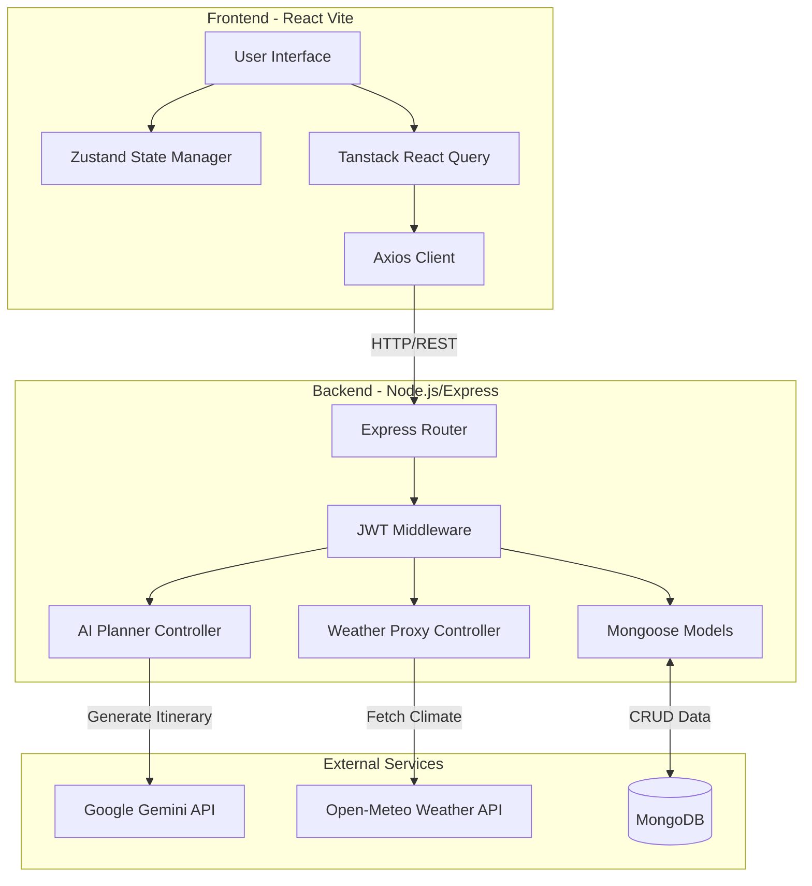
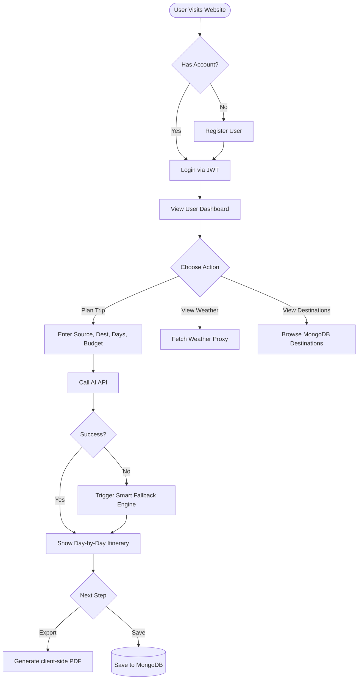
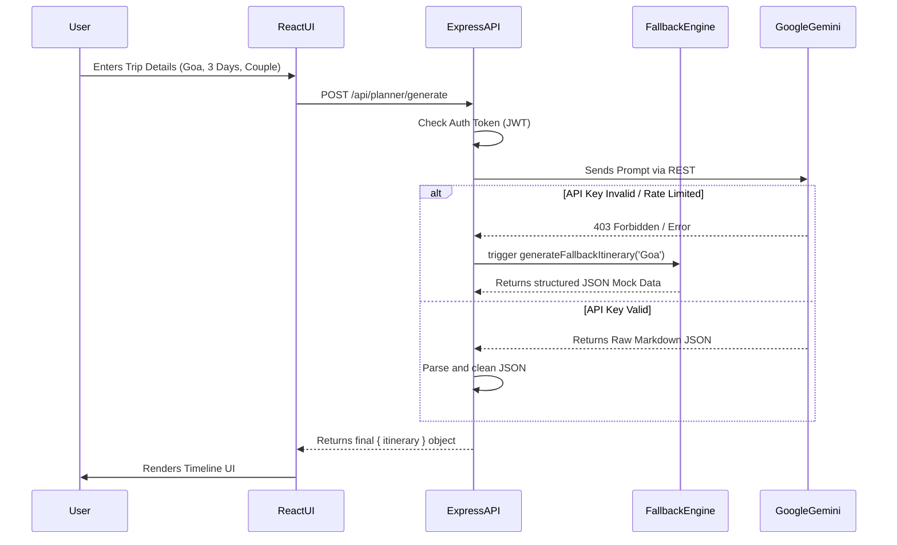

# TripWise Architecture & Diagrams

Copy these Mermaid.js diagrams directly into any markdown viewer or rendering tool to generate the visual graphs for your final project report.

## 1. System Architecture Diagram



## 2. User Flowchart



## 3. Use Case Diagram

```mermaid
usecase
actor "Traveler (User)" as U
actor "System Admin" as A

rectangle TripWise {
  usecase "Register/Login" as UC1
  usecase "Generate AI Trip" as UC2
  usecase "View Weather" as UC3
  usecase "Export PDF Itinerary" as UC4
  usecase "Manage Destinations" as UC5
  usecase "View System Metrics" as UC6
}

U --> UC1
U --> UC2
U --> UC3
U --> UC4

A --> UC1
A --> UC5
A --> UC6
```

## 4. Sequence Diagram: AI Itinerary Generation


